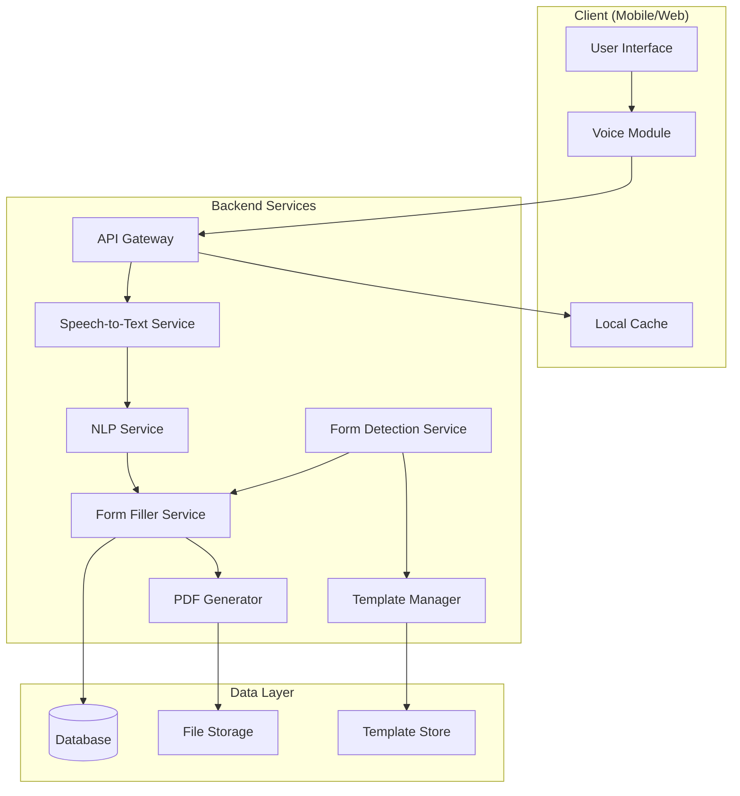

# Design Document: AI Sahayak Voice Form Assistant

## Overview

AI Sahayak is a voice-first form filling assistant designed for Indian citizens with low digital literacy. The system architecture follows a modular design with clear separation between voice processing, natural language understanding, form detection, and user interface components. The design prioritizes simplicity, low bandwidth operation, and multilingual support to serve rural and underserved populations.

The system operates in five main phases:
1. Voice capture and speech-to-text conversion
2. Natural language processing and entity extraction
3. Form field detection and mapping
4. Automatic form filling with user verification
5. PDF generation and export

## Architecture

The system follows a client-server architecture with the following components:



### Component Responsibilities

- **User Interface**: Provides simple, accessible interface with voice and touch controls
- **Voice Module**: Captures audio, manages recording state, provides visual feedback
- **API Gateway**: Routes requests, handles authentication, manages rate limiting
- **Speech-to-Text Service**: Converts audio to text using cloud STT APIs (Google/Azure)
- **NLP Service**: Extracts entities, validates data, handles multilingual processing
- **Form Detection Service**: Identifies form fields using OCR and template matching
- **Form Filler Service**: Maps extracted data to form fields, handles formatting
- **PDF Generator**: Creates filled PDF documents preserving original layout
- **Template Manager**: Manages form templates, field mappings, validation rules
- **Database**: Stores session data, user preferences (temporary, encrypted)
- **File Storage**: Stores uploaded forms and generated PDFs (temporary)
- **Template Store**: Stores form templates and metadata

## Components and Interfaces

### 1. Voice Input Module

**Purpose**: Capture and preprocess audio input from users

**Interface**:
```typescript
interface VoiceInputModule {
  startRecording(): Promise<RecordingSession>
  stopRecording(sessionId: string): Promise<AudioData>
  getRecordingStatus(sessionId: string): RecordingStatus
  cancelRecording(sessionId: string): void
}

interface RecordingSession {
  sessionId: string
  startTime: number
  status: 'recording' | 'paused' | 'stopped'
}

interface AudioData {
  audioBlob: Blob
  duration: number
  format: 'wav' | 'mp3' | 'webm'
  sampleRate: number
}

type RecordingStatus = 'idle' | 'recording' | 'processing' | 'error'
```

**Implementation Details**:
- Uses Web Audio API for browser-based capture
- Implements silence detection (2-second threshold)
- Compresses audio to reduce bandwidth (opus codec, 16kbps)
- Provides visual waveform feedback during recording
- Handles microphone permissions and errors gracefully

### 2. Speech-to-Text Engine

**Purpose**: Convert audio to text with multilingual support

**Interface**:
```typescript
interface STTEngine {
  transcribe(audio: AudioData, language: Language): Promise<TranscriptionResult>
  getSupportedLanguages(): Language[]
  detectLanguage(audio: AudioData): Promise<Language>
}

interface TranscriptionResult {
  text: string
  confidence: number
  language: Language
  alternatives?: string[]
  timestamp: number
}

type Language = 'hi' | 'en' | 'mr' | 'ta' | 'te' | 'bn' | 'gu' | 'kn' | 'ml' | 'pa'
```

**Implementation Details**:
- Integrates with Google Cloud Speech-to-Text API
- Fallback to Azure Speech Services for redundancy
- Implements confidence threshold (70%) for quality control
- Caches common phrases to reduce API calls
- Handles code-switching (mixing languages)

### 3. NLP Processor

**Purpose**: Extract structured entities from transcribed text

**Interface**:
```typescript
interface NLPProcessor {
  extractEntities(text: string, language: Language): Promise<ExtractedData>
  validateEntity(entity: Entity): ValidationResult
  clarifyAmbiguity(text: string, context: FormContext): Promise<ClarificationQuestion>
}

interface ExtractedData {
  entities: Entity[]
  confidence: number
  rawText: string
}

interface Entity {
  type: EntityType
  value: string
  confidence: number
  position: { start: number; end: number }
}

type EntityType = 
  | 'name' 
  | 'age' 
  | 'date' 
  | 'phone' 
  | 'email' 
  | 'address' 
  | 'occupation' 
  | 'income'
  | 'gender'
  | 'category'

interface ValidationResult {
  isValid: boolean
  errors: string[]
  suggestions?: string[]
}

interface ClarificationQuestion {
  question: string
  expectedType: EntityType
  context: string
}
```

**Implementation Details**:
- Uses spaCy for entity recognition with custom Indian language models
- Implements regex patterns for structured data (phone, email, dates)
- Validates against Indian-specific formats (Aadhaar, PAN, pincode)
- Handles regional variations in address formats
- Transliterates regional text to English when needed

### 4. Form Detector

**Purpose**: Identify and classify form fields from documents

**Interface**:
```typescript
interface FormDetector {
  detectFields(formDocument: Document): Promise<DetectedForm>
  matchTemplate(formDocument: Document): Promise<FormTemplate | null>
  extractFieldLabels(formDocument: Document): Promise<FieldLabel[]>
}

interface Document {
  data: Blob | string
  type: 'pdf' | 'image' | 'html'
  metadata?: Record<string, any>
}

interface DetectedForm {
  fields: FormField[]
  layout: LayoutInfo
  confidence: number
  templateId?: string
}

interface FormField {
  id: string
  type: FieldType
  label: string
  position: BoundingBox
  required: boolean
  format?: string
  options?: string[]
}

type FieldType = 
  | 'text' 
  | 'number' 
  | 'date' 
  | 'checkbox' 
  | 'radio' 
  | 'dropdown' 
  | 'textarea'

interface BoundingBox {
  x: number
  y: number
  width: number
  height: number
}

interface LayoutInfo {
  pageCount: number
  orientation: 'portrait' | 'landscape'
  dimensions: { width: number; height: number }
}

interface FormTemplate {
  id: string
  name: string
  authority: string
  fieldMappings: FieldMapping[]
  validationRules: ValidationRule[]
}

interface FieldMapping {
  fieldId: string
  entityType: EntityType
  required: boolean
  format?: string
}
```

**Implementation Details**:
- Uses Tesseract.js for OCR on image-based forms
- Implements PDF.js for PDF form field extraction
- Maintains template library for common government forms
- Uses computer vision to detect field boundaries
- Implements fuzzy matching for field label recognition

### 5. Form Filler

**Purpose**: Map extracted data to form fields and populate forms

**Interface**:
```typescript
interface FormFiller {
  fillForm(form: DetectedForm, data: ExtractedData): Promise<FilledForm>
  mapDataToFields(data: ExtractedData, fields: FormField[]): FieldMapping[]
  formatFieldValue(value: string, field: FormField): string
  validateFilledForm(form: FilledForm): ValidationResult
}

interface FilledForm {
  formId: string
  fields: FilledField[]
  unmatchedData: Entity[]
  emptyFields: FormField[]
  completeness: number
}

interface FilledField {
  fieldId: string
  value: string
  confidence: number
  source: Entity
}
```

**Implementation Details**:
- Implements intelligent field matching using semantic similarity
- Handles field format requirements (uppercase, date formats, etc.)
- Prioritizes required fields over optional fields
- Maintains context for ambiguous mappings
- Supports multi-field entities (full address split into components)

### 6. PDF Generator

**Purpose**: Create downloadable PDF documents with filled data

**Interface**:
```typescript
interface PDFGenerator {
  generatePDF(form: FilledForm, template: Document): Promise<PDFDocument>
  preserveLayout(original: Document, filled: FilledForm): Promise<PDFDocument>
  addWatermark(pdf: PDFDocument, text: string): Promise<PDFDocument>
}

interface PDFDocument {
  data: Blob
  filename: string
  size: number
  pageCount: number
}
```

**Implementation Details**:
- Uses pdf-lib for PDF manipulation
- Preserves original form layout and styling
- Ensures filled text is clearly visible and properly positioned
- Adds optional watermark for draft versions
- Compresses output to reduce file size

### 7. Verification Interface

**Purpose**: Allow users to review and edit filled forms

**Interface**:
```typescript
interface VerificationInterface {
  displayFilledForm(form: FilledForm): void
  editField(fieldId: string, newValue: string): Promise<void>
  editFieldByVoice(fieldId: string): Promise<void>
  confirmForm(): Promise<boolean>
  highlightIssues(form: FilledForm): void
}
```

**Implementation Details**:
- Displays form in read-only mode with edit buttons
- Highlights empty fields in yellow, errors in red
- Supports both text and voice editing
- Provides field-by-field navigation
- Requires explicit confirmation before PDF generation

## Data Models

### Session Data

```typescript
interface Session {
  sessionId: string
  userId?: string
  language: Language
  startTime: number
  lastActivity: number
  status: SessionStatus
  formData: FormData
  audioHistory: AudioData[]
  transcriptionHistory: TranscriptionResult[]
}

type SessionStatus = 'active' | 'completed' | 'expired' | 'error'

interface FormData {
  formId?: string
  templateId?: string
  detectedForm?: DetectedForm
  extractedData?: ExtractedData
  filledForm?: FilledForm
  generatedPDF?: PDFDocument
}
```

### User Preferences

```typescript
interface UserPreferences {
  userId: string
  preferredLanguage: Language
  fontSize: 'small' | 'medium' | 'large'
  highContrast: boolean
  audioFeedback: boolean
  voiceNavigation: boolean
}
```

### Form Template

```typescript
interface FormTemplate {
  id: string
  name: string
  authority: string
  category: string
  version: number
  createdAt: number
  updatedAt: number
  fieldMappings: FieldMapping[]
  validationRules: ValidationRule[]
  documentTemplate: Document
}

interface ValidationRule {
  fieldId: string
  rule: 'required' | 'format' | 'range' | 'dependency'
  parameters: Record<string, any>
  errorMessage: string
}
```

## Correctness Properties

*A property is a characteristic or behavior that should hold true across all valid executions of a system—essentially, a formal statement about what the system should do. Properties serve as the bridge between human-readable specifications and machine-verifiable correctness guarantees.*


### Property 1: Recording Session Creation

*For any* user action to start recording, the Voice_Input_Module should return a valid recording session with status set to 'recording' and a unique session ID.

**Validates: Requirements 1.1, 1.2**

### Property 2: Low Quality Audio Rejection

*For any* audio input with poor quality indicators (low signal-to-noise ratio, excessive distortion), the system should request the user to repeat their input rather than proceeding with transcription.

**Validates: Requirements 1.4**

### Property 3: Transcription Result Availability

*For any* successful speech-to-text conversion, the STT_Engine should return a TranscriptionResult containing the transcribed text, confidence score, and detected language.

**Validates: Requirements 2.2**

### Property 4: Low Confidence Confirmation Request

*For any* transcription result with confidence below 70%, the system should request user confirmation before proceeding with entity extraction.

**Validates: Requirements 2.3**

### Property 5: Error Recovery with Retry

*For any* failed operation (transcription, entity extraction, PDF generation), the system should return a descriptive error message and provide a retry mechanism without losing previous progress.

**Validates: Requirements 2.5, 7.5, 13.4**

### Property 6: Language Persistence

*For any* session where a user selects a language, all subsequent voice processing operations should use that selected language until explicitly changed.

**Validates: Requirements 3.2**

### Property 7: Language Switching

*For any* active session, users should be able to switch the processing language at any point, and the new language should be applied to all subsequent operations.

**Validates: Requirements 3.4**

### Property 8: Transliteration Validity

*For any* regional language text that requires transliteration to English, the output should contain only valid English characters (a-z, A-Z, 0-9, and common punctuation).

**Validates: Requirements 3.5**

### Property 9: Entity Extraction Completeness

*For any* text containing structured information (name, age, phone, email, address), the NLP_Processor should extract all identifiable entities and return them with their types and confidence scores.

**Validates: Requirements 4.1, 4.2**

### Property 10: Ambiguity Detection

*For any* input text where entity type or value is ambiguous (e.g., "Raj" could be first or last name), the NLP_Processor should generate a clarification question rather than making an assumption.

**Validates: Requirements 4.3**

### Property 11: Format Validation

*For any* extracted entity, the NLP_Processor should validate it against expected formats (10-digit phone numbers, valid email format, numeric age) and reject invalid values.

**Validates: Requirements 4.4, 4.5**

### Property 12: Field Type Recognition

*For any* form document containing standard field types (text boxes, checkboxes, radio buttons, dropdowns, date fields), the Form_Detector should correctly identify and classify each field type.

**Validates: Requirements 5.2**

### Property 13: Label-Field Association

*For any* form with field labels, the Form_Detector should extract each label and associate it with its corresponding input field with correct pairing.

**Validates: Requirements 5.3**

### Property 14: Low Confidence Field Confirmation

*For any* form field detection with confidence below 80%, the system should request manual confirmation of the detected fields before proceeding with auto-filling.

**Validates: Requirements 5.5**

### Property 15: Data-to-Field Mapping

*For any* combination of extracted entities and detected form fields, the Form_Filler should create mappings between compatible data and fields based on entity type and field label matching.

**Validates: Requirements 6.1**

### Property 16: Complete Field Population

*For any* set of data-to-field mappings, the Form_Filler should populate all mapped fields, leaving only unmapped fields empty.

**Validates: Requirements 6.2, 6.4**

### Property 17: Context-Based Disambiguation

*For any* scenario where multiple fields could match the same entity (e.g., "current address" and "permanent address" both matching an address entity), the Form_Filler should use field labels and context to select the most appropriate field.

**Validates: Requirements 6.3**

### Property 18: Field Format Compliance

*For any* field with format requirements (uppercase, specific date format, numeric only), the Form_Filler should transform the entity value to match the required format before populating the field.

**Validates: Requirements 6.5**

### Property 19: PDF Generation Success

*For any* completed filled form, the PDF_Generator should produce a valid PDF document that can be opened by standard PDF readers.

**Validates: Requirements 7.1**

### Property 20: Layout Preservation

*For any* original form document and its filled version, the generated PDF should maintain the same layout structure, field positions, and visual formatting as the original.

**Validates: Requirements 7.2**

### Property 21: Verification Interface Completeness

*For any* filled form presented for verification, the interface should display all detected fields (both filled and empty) for user review.

**Validates: Requirements 8.1, 8.4**

### Property 22: Field Edit Application

*For any* field edit request (via voice or text), the Verification_Interface should update the field value and reflect the change in the displayed form immediately.

**Validates: Requirements 8.2, 8.3**

### Property 23: Confirmation Requirement

*For any* form in verification state, the system should block PDF generation until the user provides explicit confirmation.

**Validates: Requirements 8.5**

### Property 24: Audio Compression

*For any* audio data prepared for transmission, the compressed version should be smaller in size than the original while maintaining sufficient quality for transcription.

**Validates: Requirements 9.2**

### Property 25: Session State Persistence

*For any* active session that experiences connection loss, the system should save the current state (extracted data, filled fields, user preferences) and restore it when connection is re-established.

**Validates: Requirements 9.3, 13.3**

### Property 26: Status Information Availability

*For any* ongoing operation, the system should provide current status information (processing, waiting, error) and estimated time remaining when applicable.

**Validates: Requirements 9.5, 11.3**

### Property 27: Data Encryption

*For any* personal information stored in the Data_Store, the data should be encrypted using AES-256 encryption before being written to storage.

**Validates: Requirements 10.1**

### Property 28: Session Data Lifecycle

*For any* completed session, all associated user data should be automatically deleted from the Data_Store after PDF generation is complete.

**Validates: Requirements 10.2**

### Property 29: Data Deletion Compliance

*For any* user-initiated data deletion request, all associated data should be permanently removed from the system and not be retrievable afterward.

**Validates: Requirements 10.5**

### Property 30: Localized Audio Instructions

*For any* user with a selected language preference, all audio instructions provided by the Verification_Interface should be in that language.

**Validates: Requirements 12.2**

### Property 31: Localized Error Messages

*For any* error that occurs during system operation, the error message should be displayed in the user's selected language with specific guidance on resolution.

**Validates: Requirements 13.1, 13.2**

### Property 32: Alternative Input Fallback

*For any* operation that fails repeatedly (3+ times), the system should offer an alternative input method (e.g., text input if voice fails, manual field selection if auto-detection fails).

**Validates: Requirements 13.5**

### Property 33: Template Metadata Persistence

*For any* form template uploaded to the system, the associated metadata (name, authority, field mappings, validation rules) should be stored and retrievable with the template.

**Validates: Requirements 14.2**

### Property 34: Template Versioning

*For any* form template update, the system should increment the version number and maintain access to previous versions for backward compatibility.

**Validates: Requirements 14.3**

### Property 35: Template Configuration

*For any* form template, administrators should be able to define and modify field mappings and validation rules, and these configurations should be applied when the template is used.

**Validates: Requirements 14.4**

### Property 36: Template Library Access

*For any* user, the system should provide access to the complete template library with the ability to search and select templates.

**Validates: Requirements 14.5**

### Property 37: Audio Description Generation

*For any* visual element in the Verification_Interface, the system should generate and provide an audio description that conveys the element's purpose and state.

**Validates: Requirements 15.1**

### Property 38: Font Size Adjustment

*For any* font size adjustment request (100% to 200%), the Verification_Interface should apply the new size to all text elements and maintain readability.

**Validates: Requirements 15.3**

### Property 39: High Contrast Mode

*For any* user who enables high contrast mode, the Verification_Interface should apply a high contrast color scheme to all visual elements.

**Validates: Requirements 15.4**

### Property 40: Voice-Only Navigation

*For any* navigation action in the Verification_Interface, users should be able to complete the action using voice commands without requiring touch or mouse interaction.

**Validates: Requirements 15.5**

## Error Handling

The system implements comprehensive error handling across all components:

### Error Categories

1. **Input Errors**
   - Microphone access denied
   - Poor audio quality
   - Unsupported audio format
   - Silence timeout

2. **Processing Errors**
   - STT service unavailable
   - Low transcription confidence
   - Entity extraction failure
   - Language detection failure

3. **Form Errors**
   - Invalid form format
   - Field detection failure
   - Template not found
   - Mapping ambiguity

4. **System Errors**
   - Network connection lost
   - Service timeout
   - Storage failure
   - PDF generation failure

### Error Handling Strategy

**Graceful Degradation**:
- System continues operating with reduced functionality when possible
- Offers alternative input methods when primary method fails
- Caches data locally when network is unavailable

**User Communication**:
- All errors displayed in user's selected language
- Clear, non-technical error messages
- Specific guidance on how to resolve the issue
- Visual and audio error notifications

**Recovery Mechanisms**:
- Automatic retry with exponential backoff for transient failures
- Session state preservation across errors
- Manual retry option for all failed operations
- Fallback to alternative services (e.g., Azure STT if Google fails)

**Error Logging**:
- All errors logged with timestamp, context, and stack trace
- User-identifiable information excluded from logs
- Error patterns monitored for system health

## Testing Strategy

The AI Sahayak system requires a dual testing approach combining unit tests for specific scenarios and property-based tests for universal correctness guarantees.

### Unit Testing

Unit tests focus on:
- **Specific examples**: Testing concrete scenarios like "user says 'my name is Rajesh Kumar'" produces correct name entity
- **Edge cases**: Empty audio input, extremely long utterances, special characters in names
- **Integration points**: API contracts between components, data format conversions
- **Error conditions**: Network failures, invalid inputs, service timeouts

**Testing Framework**: Jest (for TypeScript/JavaScript components), pytest (for Python NLP components)

**Coverage Goals**: Minimum 80% code coverage for core business logic

### Property-Based Testing

Property-based tests verify the 40 correctness properties defined above. Each property test should:
- Run minimum 100 iterations with randomized inputs
- Reference the design document property number
- Tag format: **Feature: ai-sahayak-voice-form-assistant, Property {N}: {property description}**

**Testing Framework**: 
- **fast-check** for TypeScript/JavaScript components
- **Hypothesis** for Python components

**Property Test Examples**:

```typescript
// Property 6: Language Persistence
test('Feature: ai-sahayak-voice-form-assistant, Property 6: Language persistence across session', () => {
  fc.assert(
    fc.property(
      fc.constantFrom('hi', 'en', 'mr', 'ta', 'te'),
      fc.array(fc.string(), { minLength: 1, maxLength: 10 }),
      (language, utterances) => {
        const session = createSession(language);
        utterances.forEach(utterance => {
          const result = processVoiceInput(session, utterance);
          expect(result.language).toBe(language);
        });
      }
    ),
    { numRuns: 100 }
  );
});

// Property 11: Format Validation
test('Feature: ai-sahayak-voice-form-assistant, Property 11: Phone number validation', () => {
  fc.assert(
    fc.property(
      fc.string(),
      (input) => {
        const entity = extractEntity(input, 'phone');
        if (entity) {
          expect(entity.value).toMatch(/^\d{10}$/);
        }
      }
    ),
    { numRuns: 100 }
  );
});
```

### Integration Testing

Integration tests verify end-to-end workflows:
- Voice input → transcription → entity extraction → form filling → PDF generation
- Error recovery flows
- Multi-language scenarios
- Template-based form filling

### Performance Testing

Performance tests validate:
- Response time under normal conditions (< 3 seconds)
- Concurrent user handling (100+ simultaneous sessions)
- Low bandwidth operation
- Memory usage on low-end devices

### Accessibility Testing

Accessibility tests verify:
- Screen reader compatibility
- Voice-only navigation
- High contrast mode
- Font scaling

### Security Testing

Security tests validate:
- Data encryption at rest and in transit
- Session isolation
- Data deletion compliance
- Input sanitization

## Deployment Considerations

### Infrastructure

**Cloud Platform**: AWS or Google Cloud Platform
- **Compute**: Container-based deployment (Docker + Kubernetes)
- **Storage**: S3/Cloud Storage for templates and temporary PDFs
- **Database**: PostgreSQL for session data (encrypted)
- **CDN**: CloudFront/Cloud CDN for static assets

**External Services**:
- Google Cloud Speech-to-Text API (primary)
- Azure Speech Services (fallback)
- Tesseract OCR (self-hosted)

### Scalability

- Horizontal scaling for API servers
- Auto-scaling based on request volume
- Caching layer (Redis) for templates and common responses
- Queue-based processing for PDF generation

### Monitoring

- Application performance monitoring (APM)
- Error tracking and alerting
- Usage analytics (anonymized)
- Service health dashboards

### Security

- HTTPS/TLS for all communications
- API authentication using JWT tokens
- Rate limiting to prevent abuse
- Regular security audits
- Data retention policies

## Future Enhancements

1. **WhatsApp Integration**: Allow form filling through WhatsApp bot
2. **Offline Mode**: Full offline support with local STT models
3. **Document Scanning**: OCR for physical documents via camera
4. **Direct Submission**: Integration with government portals for direct form submission
5. **Scheme Guidance**: AI chatbot to help users find relevant schemes
6. **SMS Alerts**: Status notifications via SMS
7. **Voice Biometrics**: Voice-based user authentication
8. **Regional Language Models**: Custom NLP models for better regional language support
